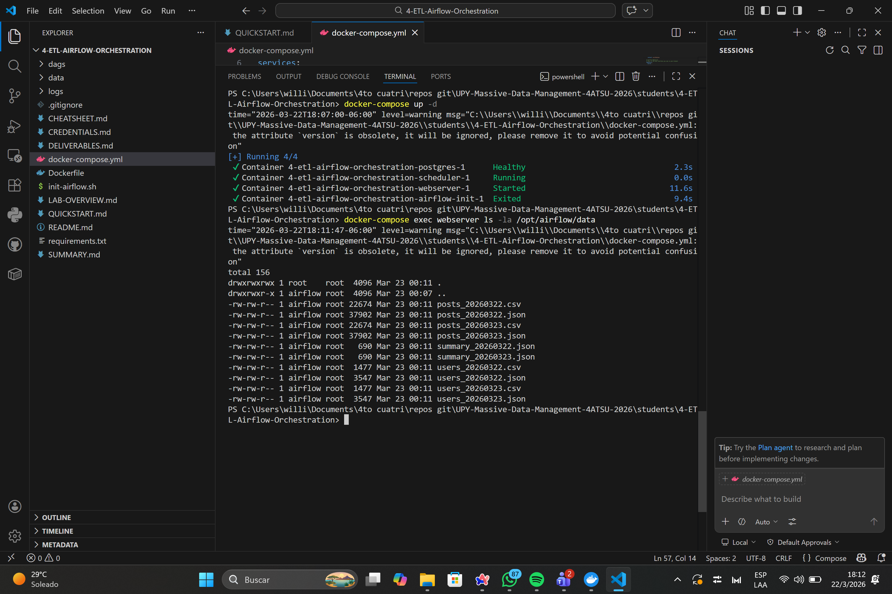
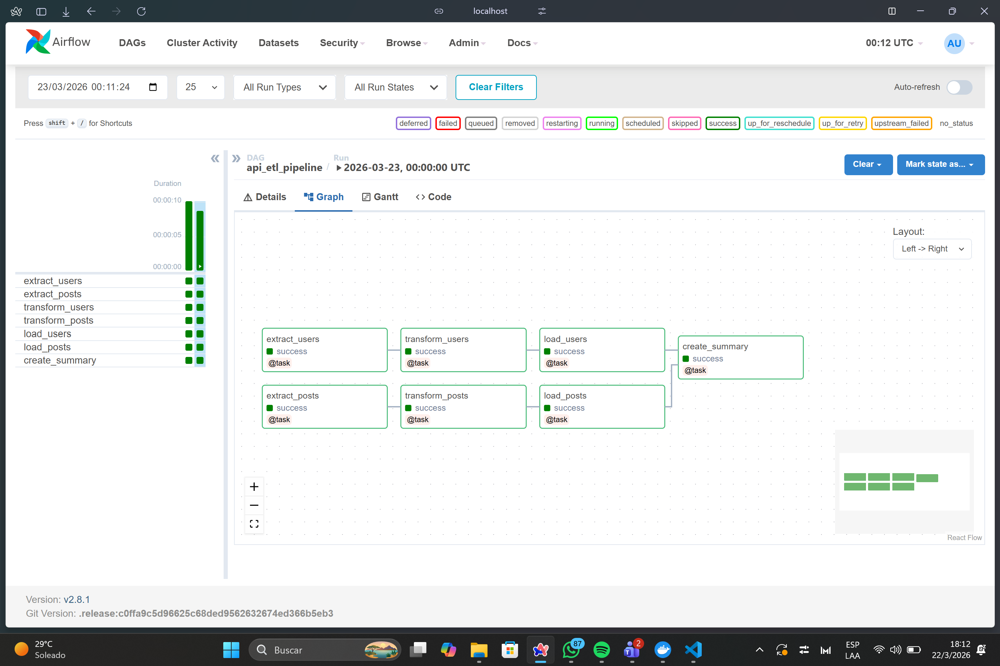
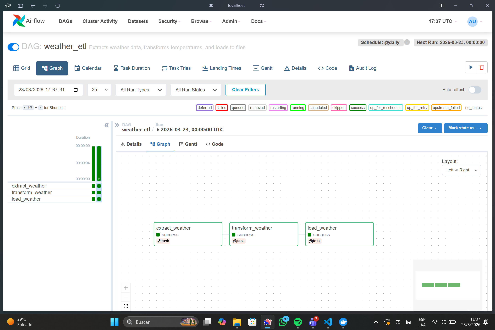

# Weather Data ETL Pipeline with Apache Airflow

## Overview

This project demonstrates a complete ETL (Extract, Transform, Load) pipeline built with Apache Airflow. The pipeline retrieves hourly weather forecast data for Mérida, Yucatán, from the OpenMeteo API, processes the data with Pandas, and stores the results in CSV and JSON formats.

The goal of this project was to practice workflow orchestration, API integration, data transformation, and automated data processing using industry-standard tools.

## Technologies Used

* Python
* Apache Airflow
* Pandas
* Requests
* Docker
* JSON
* CSV

## ETL Process

### Extraction

The process connects to the OpenMeteo API and retrieves hourly weather forecast information, including:

* Temperature
* Apparent Temperature
* Probability of Precipitation

Location Used:

* Mérida, Yucatán, Mexico

### Transformation

The raw data is processed with Pandas:

* Conversion of temperatures from Celsius to Fahrenheit
* Creation of climate categories
* Generation of descriptive statistics
* Counting hours with a high probability of precipitation
* Calculation of distributions by category

### Loading

The processed data is exported as:

* CSV file for analysis
* JSON file for integrations and storage

The files are automatically generated with the execution date included in the filename.

## Project Structure

```text
airflow-etl-pipeline/
│
├── code/
│ └── weather_etl.py
│
├── data samples/
│ ├── weather_20260323.csv
│ └── weather_20260323.json
│
├── screenshots/
│ ├── airflow-ui.png
│ ├── dag-graph.png
│ ├── generated files.png
│ └── Execution successful.png

│
├── requirements.txt
├── .gitignore
└── README.md
```

## Airflow DAG

The pipeline is implemented using the Airflow TaskFlow API.

Workflow:

```text
Extract weather data

↓
Transform weather data

↓
Load CSV and JSON files
```

## Example output

The generated files contain:

### Weather records

* Date and time
* Temperature (°C)
* Temperature (°F)
* Apparent temperature
* Probability of precipitation
* Temperature category

### Summary statistics

* Maximum temperature
* Minimum temperature
* Average temperature
* Hours with high probability of rain
* Hot hours
* Mild hours
* Cool hours

## Screenshots

### Airflow DAG Execution

<p align="center">
  
</p>

### DAG Graph View

<p align="center">
  
</p>

### Generated Output Files

<p align="center">
  
</p>

## How to run

### Clone the repository

```bash
git clone https://github.com/WillyyyFernandez/airflow-etl-pipeline.git
cd airflow-etl-pipeline
```

### Install dependencies

```bash
pip install -r requirements.txt
```

### Run Airflow

Configure your Airflow environment and place the DAG in the corresponding DAGs folder.

Once Airflow is running, enable the DAG named:

```text
weather_etl
```

The workflow will run daily and automatically generate output files.


## Challenges and Lessons Learned

During development, I encountered several common practical problems in real-world environments:

* Docker port conflicts when launching Airflow services
* DAG detection issues caused by incorrect file locations
* API response management and validation
* Efficient design of transformations with Pandas

These challenges allowed me to gain hands-on experience in workflow orchestration and ETL development.


## Future Improvements

Possible next steps for this project include:

* Storing results in PostgreSQL instead of files
* Adding data quality validations
* Creating automated alerts for failures
* Deploying the pipeline in a cloud environment
* Adding climate trend visualizations


## Author

William Fernandez

Data Engineering and Artificial Intelligence Student

GitHub: https://github.com/WillyyyFernandez
